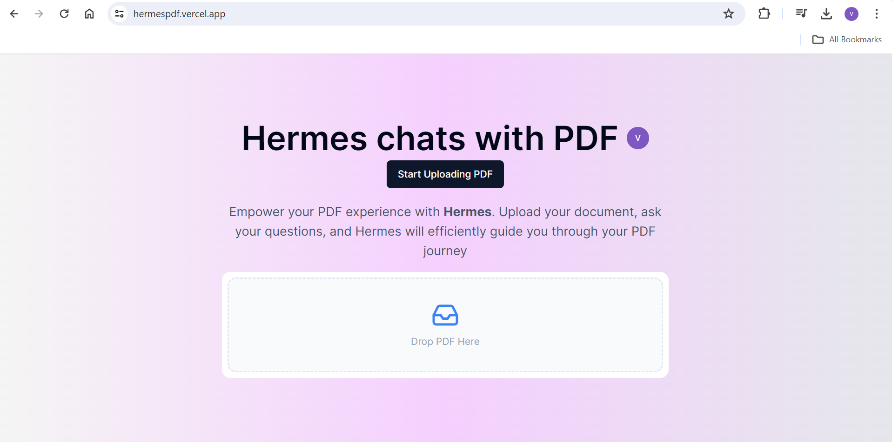

# Overview

Welcome to the "Hermes" project, a comprehensive chat application with PDF integration. This project is designed to provide a seamless chat experience where users can upload PDF files, create chats around them, and interact with an AI assistant. The AI assistant uses the OpenAI API to generate responses based on the chat context.

Link: https://hermespdf.vercel.app/

Disclaimer: I have used free tier APIs which expires in few days so deployed application may not work.


# Technologies and Frameworks

- Next.js
- React
- TypeScript
- Tailwind CSS
- Clerk
- Drizzle ORM
- PostgreSQL
- AWS SDK
- OpenAI API
- Axios
- Pinecone
- Drizzle-kit
- OpenAI Edge
- Neon Database Serverless
- Drizzle-orm/neon-http
- @tanstack/react-query
- @clerk/nextjs
- clsx
- tailwind-merge

# Prerequisites
Ensure you have the following installed:
- [Node.js](https://nodejs.org/)
- [Next.js](https://nextjs.org/)
- [CLERK](https://clerk.dev/) account for authentication
- [AWS Account](https://aws.amazon.com/) with S3 configured
- [NEON Database](https://neon.tech/) setup

# Additional Setup
-  CLERK: Ensure you have configured CLERK for authentication by following their documentation (https://clerk.com/docs/quickstarts/nextjs).
- AWS S3: Set up an S3 bucket and configure the necessary permissions. Refer to AWS's S3 documentation (https://docs.aws.amazon.com/s3/).
- NEON Database: Ensure your NEON Database is set up and accessible. Refer to NEON's documentation (https://neon.tech/docs/introduction).

# Installation

Follow the steps below to install and setup the project:

1. **Clone the repository**

   Open your terminal and run the following command:

   ```bash
   git clone https://github.com/ViplavKhode/hermes.git
   ```

2. **Navigate to the project directory**

   ```bash
   cd Hermes
   ```

3. **Install Node.js**

   The project requires Node.js version 13.4.19 or later. You can download it from [here](https://nodejs.org/en/download/).

4. **Install the required dependencies**

   Run the following command to install all the required dependencies:

   ```bash
   npm install
   ```

   This will install all the dependencies listed in the `package.json` file, including Next.js, React, React DOM, Axios, Tailwind CSS, and other specific dependencies such as "@aws-sdk/client-s3" and "@clerk/nextjs".

5. **Setup environment variables**

    Create a `.env` file in the root directory of your project and add the required environment variables.

6. **Run the project**

    Now, you can run the project using the following command:

    ```bash
    npm run dev
    ```

    Open [http://localhost:3000](http://localhost:3000) with your browser to see the result.

# Summary
The README provides a concise overview of Hermes, highlights its core features, and lists the prerequisites needed to get started with the project. The platform focuses on enhancing user interaction with PDF documents through AI, ensuring secure data handling and efficient information extraction.


## Authors

- [@ViplavKhode](https://github.com/ViplavKhode)
